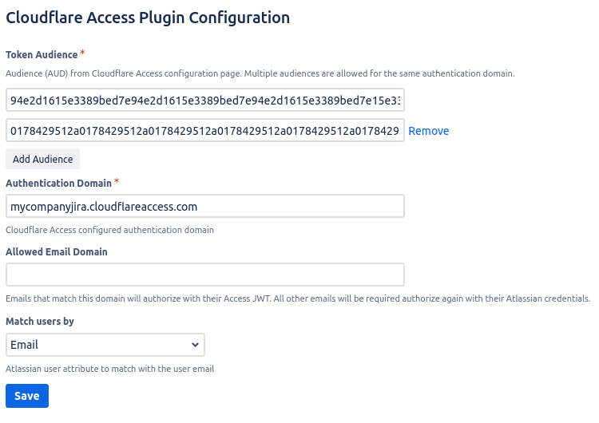

# Cloudflare Access For Atlassian

This project implements a set of plugins for authenticating users through Cloudflare Access on Atlassian products.

Currently supported Atlassian products versions:
- JIRA `>= 7.2`
- Confluence  `6`,`7`,`8` 
- Bitbucket `>= 6.x`

## Installation

These instructions apply to all supported Atlassian products, installed locally.
 
1. Download the respective plugin from [Releases](https://github.com/cloudflare/cloudflare-access-for-atlassian/releases) page
1. Login in the Atlassian application as administrator
1. Go to *Manage add-ons* on the administration page or menu
1. Select *Upload add-on* and upload the JAR you downloaded
1. Go to *System configuration* or administration page
1. Go to *Cloudflare Access* menu on the left side menu
1. Setup your Cloudflare Access and server details

## Plugin Configuration

The configuration screen looks like below in all Atlassian products and the values to be placed in the required 
fields are available in your Cloudflare Access configuration.

| Option                           | Description                                                                                                                                             |
|----------------------------------|---------------------------------------------------------------------------------------------------------------------------------------------------------|
| Token Audience (required)        | Audience(s) from Cloudflare Access configuration page. Multiple audiences are allowed for the same authentication domain.                               |
| Authentication Domain (required) | Cloudflare Access configured authentication domain                                                                                                      |
| Allowed Email Domain             | Emails that match this domain will authorize with their Access JWT. All other emails will be required authorize again with their Atlassian credentials. |
| Match users by                   | Users can be matched by email or username field                                                                                                         |

The configuration is stored and is kept between plugin and Atlassian updates.

## Updates

Whenever a new version is released, admins will get a notification in Atlassian product UI indicating that 
a new version is available.

## Other Documentation Links

- [Troubleshooting](docs/Troubleshooting.md)
- [Plugin development](docs/Development.md)
- [Plugin testing](docs/Testing.md)